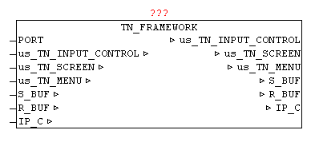

<!--
  Copyright (c) 2026 Hans Mühlbauer, Franz Höpfinger and others.

  This program and the accompanying materials are made available under the
  terms of the Eclipse Public License 2.0 which is available at
  https://www.eclipse.org/legal/epl-2.0

  SPDX-License-Identifier: EPL-2.0
-->

## TN_FRAMEWORK

| | |
|:---|:---|
| **Type** | Function module |
| **IN_OUT	Xus_TN_INPUT_CONTROL** | Us_TN_INPUT_CONTROL |
| **Xus_TN_SCREEN** | Us_TN_SCREEN |
| **Xus_TN_MENU** | us_TN_MENU |
| **S_BUF** | NETWORK_BUFFER (transmit data) |
| **R_BUF** | NETWORK_BUFFER (receive data) |
| **IP_C** | IP_CONTROL (parameterization) |
| | The module TN_FRAMEWORK is a frame structure, which provides a finished maturity model for TELNET-Vision . |
| | The following tasks and functions are treated. |
| | Connection setup and breakdown with Telnet Client |
| | Send and receive data |
| | Data structures for graphics functions |
| | INPUT_CONTROL elements |
| | Intelligent automatic updating of the Telnet display |
| | Menu bar display |
| | Direct access to all data structures for user program |

