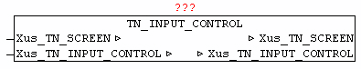

<!--
  Copyright (c) 2026 Hans Mühlbauer, Franz Höpfinger and others.

  This program and the accompanying materials are made available under the
  terms of the Eclipse Public License 2.0 which is available at
  https://www.eclipse.org/legal/epl-2.0

  SPDX-License-Identifier: EPL-2.0
-->

## TN_INPUT_CONTROL

| | |
|:---|:---|
| **Type** | Function module |
| **IN_OUT	Xus_TN_SCREEN** | Us_TN_SCREEN |
| **Xus_TN_INPUT_CONTROL** | us_TN_INPUT_CONTROL |
| | The module TN_INPUT_CONTROL is used to manage the INPUT_CONTROL elements. If Xus_TN_INPUT_CONTROL.bo_Reset_Fokus = TRUE then the FOCUS is disabled on all elements and the first item gets to the focus. Using the  cursor up / down buttons and tab, the individual elements can be selected or changed. The current element loses focus and then the next following item gets the input focus reallocated. At the focus change of the elements automatically a redraw of the respective elements is triggered. The image/flashing cursor is always positioned at each active element and is displayed. It always automatically displays and updates the ToolTip text, as this has been configured. |
| | It supports the following elements. |
| | TN_INPUT_EDIT_LINE |
| | TN_INPUT_SELECT_TEXT |
| | TN_INPUT_SELECT_POPUP |

