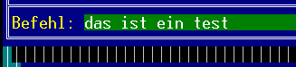

<!--
  Copyright (c) 2026 Hans Mühlbauer, Franz Höpfinger and others.

  This program and the accompanying materials are made available under the
  terms of the Eclipse Public License 2.0 which is available at
  https://www.eclipse.org/legal/epl-2.0

  SPDX-License-Identifier: EPL-2.0
-->

## TN_INPUT_EDIT_LINE

| | | |
|:---|:---|:---|
| **Type** | Function module | |
| **IN_OUT	Xus_TN_SCREEN** | Us_TN_SCREEN | |
| **Xus_TN_INPUT_CONTROL** | us_TN_INPUT_CONTROL | |
| | The module TN_INPUT_EDIT_LINE is used to manage a command line. This must be set *. in_TYPE = 1. | |
| | The item will be provided as *.in_X and *.in_Y. Every entry line can be provided with a title text. With *.in_Title_Y_Offset and *.in_Title_X_Offset  the position relative to the element coordinates is expressed. The color can be determined with *.by_Title_Attr, and the text by *.st_Title_String. If a tool tip should appear at the element *. st_Input_ToolTip the text hast to be specified. | |
| | If the item has focus, using the keyboard cursor left / right  the flashing cursor can be moved within the line. The backspace key can delete entered character. By pressing the Enter / Return key the input text is issued at *.st_Input_String and  *.bo_Input_Entered  ist set to TRUE. The input flag must be reset after receive by the user. Using *.bo_Input_Hidden = TRUE the hidden input is activated, thus, all input characters represented with a '*'. | |
| | Using *.st_Input_Mask determines at which position and how many characters can be entered. At each position which a space, character can be entered. During initialization *.st_Input_Mask must be copied once to *.st_Input_Data. | |
| | Is *.bo_Input_Only_Num = TRUE only numeric keys are accepted  and adopted. | |
| ***.in_Type** | = INT#01; *.in_Y := INT#16; *.in_X := INT#09; *.by_Attr_mF := BYTE#16#72; (* white, green *) *.by_Attr_oF := BYTE#16#74; (* white, blue *) *.in_Cursor_Pos := INT#0; *.bo_Input_Only_Num := FALSE; *.bo_Input_Hidden := FALSE; *.st_Input_Mask := '  '; *.st_Input_Data :=  *.st_Input_Mask; *.st_Input_ToolTip := 'inputline active  | SCROLL F1/F2/F3/F4 |'; *.in_Input_Option := INT#02; *.in_Title_Y_Offset := INT#00; *.in_Title_X_Offset := INT#00; *.by_Title_Attr := BYTE#16#34; *.st_Title_String := 'command: '; |

**Example:**

Example:

The following output:
