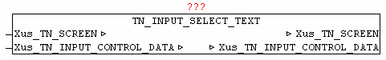
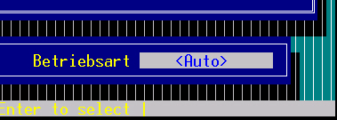

<!--
  Copyright (c) 2026 Hans Mühlbauer, Franz Höpfinger and others.

  This program and the accompanying materials are made available under the
  terms of the Eclipse Public License 2.0 which is available at
  https://www.eclipse.org/legal/epl-2.0

  SPDX-License-Identifier: EPL-2.0
-->

## TN_INPUT_SELECT_TEXT

| | | |
|:---|:---|:---|
| **Type** | Function module | |
| **IN_OUT	Xus_TN_SCREEN** | Us_TN_SCREEN | |
| **Xus_TN_INPUT_CONTROL** | us_TN_INPUT_CONTROL | |
| | The module TN_INPUT_SELECT_TEXT is used to manage a selection of texts. This must be set *.IN_TYPE = 2. | |
| | The item will be provided as *.in_X and *.in_Y. Every entry line can be provided with a title text. With *.in_Title_Y_Offset and *.in_Title_X_Offset  the position relative to the element coordinates is expressed. The color can be determined with *.by_Title_Attr, and the text by *.st_Title_String. If a tool tip should appear at the element *. st_Input_ToolTip the text hast to be specified. | |
| | The selection of texts will be handed over in *.st_Input_Data. The text element should be separated from each other by the character '#'. | |
| | If the Element has the focus, by using the spacebar (space) can be changed between the individual texts. The text-element is connected by means *.st_Input_Mask, meaning that the output text length are affected later. | |
| | By pressing the Enter / Return key the input text is issued at *.st_Input_String and  *.bo_Input_Entered  ist set to TRUE. The input flag must be reset after receive by the user. | |
| ***.in_Type** | = 2; *.in_Y := 20; *.in_X := 58; *.by_Attr_mF := 16#17; *.by_Attr_oF := 16#47; *.st_Input_ToolTip := ' selection text active  | press space to select |'; *.in_Input_Option := 02; *.in_Title_Y_Offset := 00; *.in_Title_X_Offset := 00; *.by_Title_Attr := 16#34; *.st_Title_String := ' operation mode'; *.st_Input_Mask := '  '; *.st_Input_Data := '<Auto>#<Hand>#<Stop>#<Restart>'; |

**Example:**

Example:

The following output:
