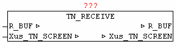

<!--
  Copyright (c) 2026 Hans Mühlbauer, Franz Höpfinger and others.

  This program and the accompanying materials are made available under the
  terms of the Eclipse Public License 2.0 which is available at
  https://www.eclipse.org/legal/epl-2.0

  SPDX-License-Identifier: EPL-2.0
-->

## TN_RECEIVE

| | | |
|:---|:---|:---|
| **Type** | Function module | |
| **IN_OUT	Xus_TN_SCREEN** | us_TN_SCREEN | |
| **R_BUF** | NETWORK_BUFFER | (Telnet receive buffer) |
| | The module TN_RECEIVE receives input data from the Telnet client, and evaluates the key codes. | |
| | If the key code in the range 32-126 it shall be stored as ASCII code under Xus_TN_SCREEN, by_Input_ASCII_Code. In addition, Xus_TN_SCREEN.bo_Input_ASCII_IsNum = TRUE if this corresponds to a number between 0 and 9. | |
| | If the key code is of the following extended code then this is filed under Xus_TN_SCREEN,by_Input_Exten_Code. | |

| Exten_code | Button name |
| --- | --- |
| 65 | Cursor up |
| 66 | Cursor down |
| 67 | Cursor RIGHT |
| 68 | Cursor left |
| 72 | Pos1 |
| 75 | End |
| 80 | F1 |
| 81 | F2 |
| 82 | F3 |
| 83 | F4 |
| 8 | Backspace |
| 9 | Tabulator |
| 13 | Return (Enter) |
| 27 | Escape |
