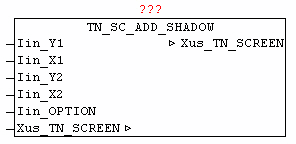

<!--
  Copyright (c) 2026 Hans Mühlbauer, Franz Höpfinger and others.

  This program and the accompanying materials are made available under the
  terms of the Eclipse Public License 2.0 which is available at
  https://www.eclipse.org/legal/epl-2.0

  SPDX-License-Identifier: EPL-2.0
-->

## TN_SC_ADD_SHADOW

| | |
|:---|:---|
| **Type** | Function module |
| **INPUT** | Iin_Y1: INT (Y1 coordinate of the area) |
| **Iin_X1** | INT: (X1 coordinate of the area) |
| **Iin_Y2** | INT (Y2 coordinate of the area) |
| **Iin_X2** | INT: (X2-coordinate of the area) |
| **Iin_OPTION** | INT: (kind of the shadow) |
| **IN_OUT	Xus_TN_SCREEN** | Us_TN_SCREEN |
| | The module TN_SC_ADD_SHADOW allows you to add optical shadow to rectangular glyphs. By specifying a rectangular area by means of the parameters X1, Y1 and X2, Y2, a basic framework is defined, at which at the right and bottom color darkened lines are drawn (shadow). The shadow coordinates X1, Y1 and X2, Y2 are always given +1 for proper primitive. OPTION means you can choose between two shadow variations. If OPITION = 0 then the shadow is reached by pure color adjustment (darkening of the character) . If an OPTION > 0, in the area of the shadow all the characters replaced by black filled characters. |

