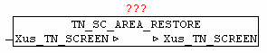

<!--
  Copyright (c) 2026 Hans Mühlbauer, Franz Höpfinger and others.

  This program and the accompanying materials are made available under the
  terms of the Eclipse Public License 2.0 which is available at
  https://www.eclipse.org/legal/epl-2.0

  SPDX-License-Identifier: EPL-2.0
-->

## TN_SC_AREA_RESTORE

| | |
|:---|:---|
| **Type** | Function module |
| **IN_OUT	Xus_TN_SCREEN** | Us_TN_SCREEN |
| | The module TN_SC_AREA_RESTORE enables recovery of previously saved screen area. The screen data in Xus_TN_SCREEN.bya_BACKUP [x] is restored using the stored coordinates. This is done mainly done after the call from the module MENU-BAR amd MENU-POPUP, to restore the modified screen. |

