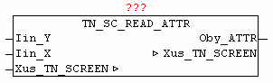

<!--
  Copyright (c) 2026 Hans Mühlbauer, Franz Höpfinger and others.

  This program and the accompanying materials are made available under the
  terms of the Eclipse Public License 2.0 which is available at
  https://www.eclipse.org/legal/epl-2.0

  SPDX-License-Identifier: EPL-2.0
-->

## TN_SC_READ_ATTR

| | |
|:---|:---|
| **Type** | Function module |
| **INPUT	Iin_Y** | INT: (Y coordinate) |
| **Iin_X** | INT: (X coordinate) |
| **OUTPUT	Oby_ATTR** | BYTE: (color information at position X / Y) |
| **IN_OUT	Xus_TN_SCREEN** | Us_TN_SCREEN |
| | The block TN_SC_READ_ATTR is used to read the current color of the character at the specified location X / Y. |

