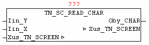

<!--
  Copyright (c) 2026 Hans Mühlbauer, Franz Höpfinger and others.

  This program and the accompanying materials are made available under the
  terms of the Eclipse Public License 2.0 which is available at
  https://www.eclipse.org/legal/epl-2.0

  SPDX-License-Identifier: EPL-2.0
-->

## TN_SC_READ_CHAR

| | |
|:---|:---|
| **Type** | Function module |
| **INPUT	Iin_Y** | INT: (Y coordinate) |
| **Iin_X** | INT: (X coordinate) |
| **OUTPUT	Oby_CHAR** | BYTE: (character at position X / Y) |
| **IN_OUT	Xus_TN_SCREEN** | Us_TN_SCREEN |
| | The module TN_SC_READ_CHAR is used to read the current character at the specified location X / Y. |

