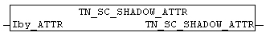

<!--
  Copyright (c) 2026 Hans Mühlbauer, Franz Höpfinger and others.

  This program and the accompanying materials are made available under the
  terms of the Eclipse Public License 2.0 which is available at
  https://www.eclipse.org/legal/epl-2.0

  SPDX-License-Identifier: EPL-2.0
-->

## TN_SC_SHADOW_ATTR

| | |
|:---|:---|
| **Type	Function** | BYTE |
| **INPUT	Iby_ATTR** | BYTE: (Color Information) |
| | The block TN_SC_SHADOW_ATTR converts a light color to a dark color. |

