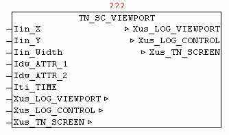

<!--
  Copyright (c) 2026 Hans Mühlbauer, Franz Höpfinger and others.

  This program and the accompanying materials are made available under the
  terms of the Eclipse Public License 2.0 which is available at
  https://www.eclipse.org/legal/epl-2.0

  SPDX-License-Identifier: EPL-2.0
-->

## TN_SC_VIEWPORT

| | |
|:---|:---|
| **Type** | Function module |
| **INPUT	Iin_Y** | INT: (Y coordinate) |
| **Iin_X** | INT: (X coordinate) |
| **Iin_Width** | INT: (width of the window - the number of characters) |
| **Idw_ATTR_1** | DWORD: (color 1,2,3 and 4) |
| **Idw_ATTR_2** | DWORD: (color 5,6,7 and 8) |
| **Iti_TIME** | TIME: (update time) |
| **IN_OUT	Xus_LOG_VIEWPORT** | LOG_VIEWPORT |
| **Xus_LOG_CONTROL** | LOG_CONTROL |
| **Xus_TN_SCREEN** | us_TN_SCREEN |
| | The module TN_SC_VIEWPORT is used to display messages from the data structure LOG_CONTROL within a rectangular area on the screen. The desired messages are processed before using with  Block LOG_VIEWPORT, and if necessary, with Xus_LOG_VIEWPORT.UPDATE an update is triggered. Means Iin_X and Iin_Y defines the upper-left corner of the window, and with Iin_Width the width if of the viewing window is defined. The number of rows to be displayed is determined by Xus_LOG_VIEWPORT.COUNT. The color information is stored in Xus_LOG_CONTROL.MSG_OPTION [x] per message. It is converted to the configured color codes from Idw_ATTR_1 and Idw_ATTR2 automatically, so the colors in the presentation  can always be adjusted individually. The messages are always automatically reduced to the width of the window or cut off. |

