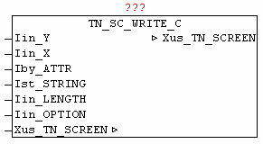

<!--
  Copyright (c) 2026 Hans Mühlbauer, Franz Höpfinger and others.

  This program and the accompanying materials are made available under the
  terms of the Eclipse Public License 2.0 which is available at
  https://www.eclipse.org/legal/epl-2.0

  SPDX-License-Identifier: EPL-2.0
-->

## TN_SC_WRITE_C

| | |
|:---|:---|
| **Type** | Function module |
| **INPUT	Iin_Y** | INT (Y coordinate) |
| **[fzy] Iin_X** | INT: (X coordinate) |
| **Iby_ATTR** | BYTE: (color code) |
| **Ist_STRING** | STRING: (text) |
| **Iin_LENGTH** | INT: (text will be adjusted to this length) |
| **Iin_OPTION** | INT: (option-length adaptation of the text) |
| **IN_OUT	Xus_TN_SCREEN** | Us_TN_SCREEN |
| | The module TN_SC_WRITE_C is at the given coordinates   Iin_Y, Iin_Y Ist_STRING the text with the color of Iby_ATTR. The text is adapted before output on the length Iin_LENGTH, and by Iin_OPTION, the text position is determined. |
| | Iin_OPTION |
| **0 = right fill with spaces** | eg   'TEST   ' |
| **1 = left fill with blanks** | eg '   TEST ' |
| | 2 = center and fill with blanks   eg '   TEST   ' |

