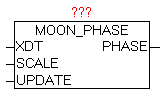

<!--
  Copyright (c) 2026 Hans Mühlbauer, Franz Höpfinger and others.

  This program and the accompanying materials are made available under the
  terms of the Eclipse Public License 2.0 which is available at
  https://www.eclipse.org/legal/epl-2.0

  SPDX-License-Identifier: EPL-2.0
-->

## MOON_PHASE

| | |
|:---|:---|
| **Type	Function module** |  |
| **INPUT	XDT** | DT (date / time) |
| **SCALE** | BYTE (scaling factor) |
| **UPDATE** | TIME (update time) |
| **OUTPUT	PHASE** | BYTE (Scaled value of the lunar phase) |
| | The module MOON_PHASE is used to calculate the moon phase pf the specified date. At parameter XDT the current date and time is passed, and always recalculated after delay of the time parameter "UPDATE". The default value for UPDATE is 1 hour and the scaling factor is 12. |
| **A moon phase takes about 29.53 days, and goes through the typical conditions of this new moon to full moon (resp. increasing and decreasing moon). This cycle can be scaled by SCALE to a desired value between 0 and 255. Example** | if 100 is given, the moon phase is displayed as a percentage. |
| | The real length of a single-moon period, is subject to relatively large variations, and thjs is not included in the calculation method used. Thus, you can identify deviations from a few hours. The viewing location (geo-location) is a virtual point in the center of the earth. |
| | If the moon phase is visualized using graphics, a scaling factor of 12 is used in order to get to the steps 0-11 |
| | See Chapter visualization - Moon Graphics |
| **http** | //de.wikipedia.org/wiki/Mondphase |

