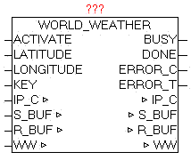
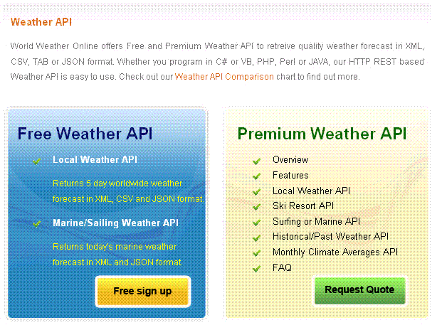

<!--
  Copyright (c) 2026 Hans Mühlbauer, Franz Höpfinger and others.

  This program and the accompanying materials are made available under the
  terms of the Eclipse Public License 2.0 which is available at
  https://www.eclipse.org/legal/epl-2.0

  SPDX-License-Identifier: EPL-2.0
-->

## WORLD_WEATHER

| | |
|:---|:---|
| **Type	Function module** |  |
| **IN_OUT	IP_C** | IP_C (parameterization) |
| **S_BUF** | NETWORK_BUFFER   (Transmit data) |
| **R_BUF** | NETWORK_BUFFER   (Receive data) |
| **WW** | WORLD_WEATHER_DATA   (Weather data) |
| **INPUT	ACTIVATE** | BOOL (positive edge starts the query) |
| **LATITUDE** | REAL (latitude of the reference location) |
| **LONGITUDE** | REAL (longitude of the reference location) |
| **KEY** | STRING (30)   (API-Key) |
| **OUTPUT	BUSY** | BOOL   (Query is active) |
| **DONE** | BOOL   (Query completed without errors) |
| **ERROR_C** | DWORD   (Error code) |
| **ERROR_T** | BYTE   (error type) |
| **The module loads the current weather data for the specified location of   http** | //worldweather.com down, analyzes the data and stores the essential data processed in the WORLD_WEATHER_DATA data structure. |
| | Following values are stored from the current day. |
| | Observation time (UTC)  Temperature (°C), Unique Weather code  Weather description text, wind speed in miles per hour, wind speed in kilometer per hour, wind direction in degree, 16-point wind direction compass, precipitation amount in millimeter, Humidity (%), Visibility (km) Atmospheric pressure in milibars , Cloud cover (%) |
| | From the current day and the next four days the following values are stored. |
| | Date For which the weather is forecasted,  Day and night temperature in °C (Celsius) and °F (Fahrenheit) Wind speed in mph (miles per hour) and kmph (kilometers per hour) 16-point compass wind direction, A unique weather condition code; Weather description text , Precipitation Amount (millimetre) |
| | With a positive edge of ACTIVATE, the query started and process a DNS query with the following HTTP-GET. After successful receiving  all data elements are processed and if necessary stored in the data structure in converted form. By the parameters of latitude and longitude the exact place (geographical position) of the weather is indicated. While the query is active, BUSY = TRUE is passed. After successful completion of the query  DONE = TRUE is shown. If an error occurs during the query it is reported in ERROR_C in combination with ERROR_T. |
| **ERROR_T** |  |
| **Creating a new API KEY** |  |
| **Use your Internet browser and call the page  http** | //www.worldweatheronline.com, call the "Free sign up"  registration dialog, and fill out the required fields. After registering, an email is sent, in turn, has to be confirmed, and subsequently secon ad e-mail is sent with the personal API key. This API Key must be passed to the module-KEY API parameters. |
| **Determine Latitude and longitude of a specific place** |  |
| **Use your Internet browser to access http** | //www.mygeoposition.com/ page, and enter the name of the desired location and search the location using "calculate the spatial data" . Then the desired location is shown on the map, including the latitude and longitude needed in decimal notation. The determined position  has to be passed to the block parameters, latitude and longitude. |

| Value | Properties |
| --- | --- |
| 1 | The exact meaning of ERROR_C can be read at module DNS_CLIENT |
| 2 | The exact meaning of ERROR_C can be read at module HTTP_GET |
