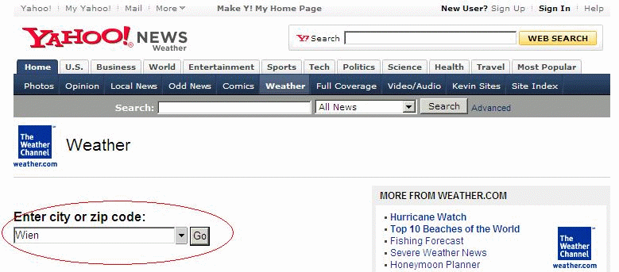

<!--
  Copyright (c) 2026 Hans Mühlbauer, Franz Höpfinger and others.

  This program and the accompanying materials are made available under the
  terms of the Eclipse Public License 2.0 which is available at
  https://www.eclipse.org/legal/epl-2.0

  SPDX-License-Identifier: EPL-2.0
-->

## YAHOO_WEATHER

| | |
|:---|:---|
| **Type	Function module** |  |
| **IN_OUT	IP_C** | IP_C (parameterization) |
| **S_BUF** | NETWORK_BUFFER   (Transmit data) |
| **R_BUF** | NETWORK_BUFFER   (Receive data) |
| **YW** | YAHOO_WEATHER  (weather data) |
| **INPUT	ACTIVATE** | BOOL (positive edge starts the query) |
| **UNITS** | BOOL (FALSE = Celsius, TRUE = Fahrenheit) |
| **LOCATION** | STRING (20)   (location specified by LOCATION-ID) |
| **OUTPUT	BUSY** | BOOL   (Query is active) |
| **DONE** | BOOL   (Query completed without errors) |
| **ERROR_C** | DWORD   (Error code) |
| **ERROR_T** | BYTE   (error type) |
| **The module loads the current weather data for the specified location using an RSS feed (XML data structure) of http** | //weather.yahooapis.com down, analyzes the XML data and provides the essential data processed from the YAHOO_WEATHER data structure. With a positive edge of ACTIVATE, the query started and process a DNS query with the following HTTP-GET. After successful receipt of data by XML_READER  all elements are processed and if necessary stored in the data structure in converted form. With UNITS may still be selected between Fahrenheit and Celsius as a unit. By specifying the precise LOCATION_ID the location of the weather is indicated. While the query is active, BUSY = TRUE is passed. After successful completion of the query  DONE = TRUE is shown. If  occur in the query, then this error is reported under ERROR_C in combination with ERROR_T. |
| **ERROR_T** |  |
| **Find the Location ID of a specific place** |  |
| **Use your Internet browser the page  http** | //weather.yahoo.com/  and in the field: "Enter city or zip code" and enter the name of the desired location and search. |
| | After being selected in the browser window displays the current weather information of the specified location. In the URL (web link) line is now the location ID can be seen. |
| | Thus, the desired settlement "Wien (Vienna)" returns the Location ID "551801".  This code must be passed on the module as parameters. |

**Example:**

Example of an RSS feed:

<?xml version="1.0" encoding="UTF-8" standalone="yes" ?>

<rss version="2.0" xmlns:yweather="http://weather.yahooapis.com/ns/rss/1.0"

xmlns:geo="http://www.w3.org/2003/01/geo/wgs84_pos#">

<channel>

<title>Yahoo! Weather - Sunnyvale, CA</title>

<link>http://us.rd.yahoo.com/dailynews/rss/weather/Sunnyvale__CA/

*http://weather.yahoo.com/forecast/94089_f.html</link>

<description>Yahoo! Weather for Sunnyvale, CA</description>

<language>en-us</language>

<lastBuildDate>Tue, 29 Nov 2005 3:56 pm PST</lastBuildDate>

<ttl>60</ttl>

<yweather:location city="Sunnyvale" region="CA" country="US"></yweather:location>

<yweather:units temperature="F" distance="mi" pressure="in" speed="mph"></yweather:units>

<yweather:wind chill="57" direction="350" speed="7"></yweather:wind>

<yweather:atmosphere humidity="93" visibility="1609" pressure="30.12"rising="0"></yweather:atmosphere>

<yweather:astronomy sunrise="7:02 am" sunset="4:51 pm"></yweather:astronomy>

<image>

<title>Yahoo! Weather</title>

<width>142</width>

<height>18</height>

<link>http://weather.yahoo.com/</link>

<url>http://us.i1.yimg.com/us.yimg.com/i/us/nws/th/main_142b.gif</url>

</image>

<item>

<title>Conditions for Sunnyvale, CA at 3:56 pm PST</title>

<geo:lat>37.39</geo:lat>

<geo:long>-122.03</geo:long>

<link>http://us.rd.yahoo.com/dailynews/rss/weather/

 Sunnyvale__CA/*

 http://weather.yahoo.com/ forecast/94089_f.html

</link>

<pubDate>Tue, 29 Nov 2005 3:56 pm PST</pubDate>

<yweather:condition text="Mostly Cloudy" code="26" temp="57" date="Tue, 29 Nov 2005 3:56

pm PST"></yweather:condition>

<description><![CDATA[

 

<b>Current Conditions:</b> 

Mostly Cloudy, 57 F

<b>Forecast:</b> 

Tue - Mostly Cloudy. High: 62 Low: 45 

Wed - Mostly Cloudy. High: 60 Low: 52 

Thu - Rain. High: 61 Low: 46 

 

<a href="http://us.rd.yahoo.com/dailynews/rss/weather/Sunnyvale__CA/*http://weather.yahoo.com/forecast/94089_f.html">Full Forecast at Yahoo! Weather</a> 

(provided by The Weather Channel) ]]>

</description>

<yweather:forecast day="Tue" date="29 Nov 2005" low="45" high="62" text="Mostly Cloudy"

code="27"></yweather:forecast>

<yweather:forecast day="Wed" date="30 Nov 2005" low="52" high="60" text="Mostly Cloudy"

code="28"></yweather:forecast>

<guid isPermaLink="false">94089_2005_11_29_15_56_PST</guid>

</item>

</channel>

</rss>

The XML data the required elements are processed and stored  in the YAHOO_WEATHER data structure.

| Value | Properties |
| --- | --- |
| 1 | The exact meaning of ERROR_C can be read at module DNS_CLIENT |
| 2 | The exact meaning of ERROR_C can be read at module HTTP_GET |
